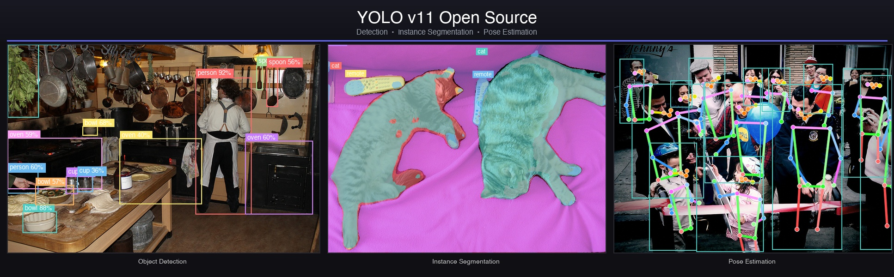

<div align="center">

# YOLO v11 Open Source

> **🚧 Update (December 2025):** Open-source weights are coming soon! I'm currently training all models from scratch on COCO. Stay tuned for fully Apache 2.0 licensed weights.

**Clean, Modular, License-Free YOLOv11 Implementation**

[](https://www.python.org/)
[](https://pytorch.org/)
[](LICENSE)

<br>



<br>

**Pure PyTorch  •  No Ultralytics Dependency  •  Multi-Task**

[Features](#features) · [Installation](#installation) · [Quick Start](#quick-start) · [Weight Transfer](#weight-transfer) · [Training](#training)

---

</div>

## Why This Project?

A complete reimplementation of YOLOv11 in pure PyTorch for researchers and engineers who need transparent, hackable code without vendor lock-in.

| | Ultralytics | This Project |
|:--|:--|:--|
| **License** | AGPL-3.0 | Apache 2.0 ✅ |
| **Commercial Use** | Requires paid license | Free ✅ |
| **Dependencies** | Ultralytics package | Pure PyTorch ✅ |
| **Architecture** | YOLOv11 | 100% Compatible ✅ |

## Features

| Detection | Segmentation | Pose Estimation |
|:---------:|:------------:|:---------------:|
| 80 COCO classes | Instance masks | 17 keypoints |
| Multi-scale FPN | Prototype masks | Skeleton connections |

## Licensing

| Component | License | Commercial Use |
|:----------|:--------|:---------------|
| **This codebase** | Apache 2.0 | ✅ Free |
| **Transferred weights** | AGPL-3.0 | ⚠️ Requires [Ultralytics License](https://ultralytics.com/license) |

> We are training fully open-source weights — stay tuned.

## Installation

```bash
git clone https://github.com/hipmusic/yolov11-pytorch.git
cd yolov11-pytorch

# With UV (recommended)
uv venv && source .venv/bin/activate
uv pip install -e .

# Or with pip
pip install -e .
```

## Quick Start

```python
import torch
from yolo import yolo_v11_n

# Detection
model = yolo_v11_n(num_classes=80, task='detect')
model.load_state_dict(torch.load('weights/open/yolo11n_open.pt')['state_dict'])
model.eval()

output = model(torch.randn(1, 3, 640, 640))  # [1, 84, 8400]
```

```python
# Segmentation
from yolo import yolo_v11_s
model = yolo_v11_s(num_classes=80, task='segment')
predictions, prototypes = model(image)

# Pose
from yolo import yolo_v11_m
model = yolo_v11_m(task='pose')
predictions = model(image)  # includes 17 keypoints
```

## Models

| Model | Params | Detection | Segmentation | Pose |
|:------|-------:|:---------:|:------------:|:----:|
| YOLOv11-N | 2.6M | ✅ | ✅ | ✅ |
| YOLOv11-S | 9.4M | ✅ | ✅ | ✅ |
| YOLOv11-M | 20.1M | ✅ | ✅ | ✅ |
| YOLOv11-L | 25.3M | ✅ | ✅ | ✅ |
| YOLOv11-X | 56.9M | ✅ | ✅ | ✅ |

## Weight Transfer

Transfer Ultralytics weights to this implementation:

### Step 1: Download Ultralytics weights

```bash
# From Google Drive (AGPL-3.0 license)
python scripts/download_weights.py

# Or download manually to weights/ultralytics/
```

### Step 2: Transfer to open format

```bash
python scripts/batch_transfer_weights.py
```

This creates clean checkpoints in `weights/open/` without Ultralytics dependencies:

```
weights/
├── ultralytics/          # Original (AGPL-3.0)
│   ├── yolo11n.pt
│   ├── yolo11n-seg.pt
│   └── yolo11n-pose.pt
└── open/                 # Transferred (still AGPL-3.0)
    ├── yolo11n_open.pt
    ├── yolo11n-seg_open.pt
    └── yolo11n-pose_open.pt
```

## Training

```bash
# Single GPU
python scripts/train.py --model s --task detect --epochs 300 --batch-size 16

# Multi-GPU
torchrun --nproc_per_node 4 scripts/train.py --model m --task segment --epochs 300
```

## Architecture

```
yolov11-pytorch/
├── yolo/
│   ├── models/
│   │   ├── backbone.py      # DarkNet
│   │   ├── neck.py          # FPN
│   │   ├── common.py        # Conv, CSP, SPP, PSA
│   │   └── heads/           # Detect, Segment, Pose
│   ├── data/                # Dataset & augmentations
│   └── utils/               # Boxes, losses, metrics
├── scripts/                 # Train, inference, weight transfer
└── configs/                 # YAML configurations
```

## Results

Architecture validated against Ultralytics:

| Task | Output Difference |
|:-----|:-----------------:|
| Detection | 0.00 ✅ |
| Segmentation | 0.00 ✅ |
| Pose | 0.00 ✅ |

## License

This project is licensed under **Apache License 2.0**. See [LICENSE](LICENSE).

## Citation

```bibtex
@software{yolov11_opensource,
  title = {YOLO v11 Open Source},
  author = {Mayard, Hippolyte},
  year = {2025},
  url = {https://github.com/hipmusic/yolov11-pytorch}
}
```

## Acknowledgments

- [YOLOv11-pt](https://github.com/jahongir7174/YOLOv11-pt) by @jahongir7174 — Initial reference
- [Ultralytics](https://github.com/ultralytics/ultralytics) — Original YOLO architecture
- [PyTorch](https://pytorch.org/) — Deep learning framework

---

<div align="center">

**Built for the Open Source Community**

</div>
